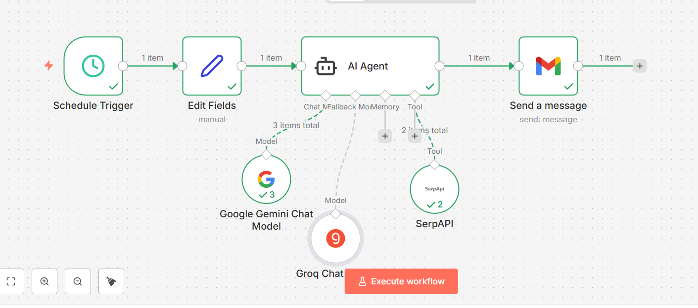

# 🚀 AI Automation Workflows with n8n

A collection of real-world **AI-powered automation workflows** built using **n8n**. These workflows integrate Large Language Models (LLMs), Google Workspace, and external APIs to automate business processes such as resume screening, meeting summarization, sentiment analysis, and AI-powered news monitoring.

## ✨ Features

- 🤖 AI-powered automation using Large Language Models
- 📄 Intelligent document and transcript processing
- 📊 Automated data collection and reporting
- 📧 Email automation with Gmail
- ☁️ Google Drive and Google Sheets integration
- 🔍 Web search and information retrieval
- 🧠 AI-generated summaries and structured outputs
- ⚡ No-code/low-code workflow automation using n8n

---

## 🛠️ Technologies Used

- n8n
- Google Gemini
- Groq LLM
- Google Drive API
- Google Sheets API
- Gmail API
- SerpAPI
- AI Agents
- Structured Output Parser

---

# 📂 Workflows

---

## 1. 📰 AI-Powered Daily LLM News Brief

Automatically searches the web for the latest developments in Large Language Models (LLMs), summarizes the most important updates using AI, and sends a professional news report via Gmail.

### Features

- Scheduled execution
- Real-time web search
- AI-generated news summary
- Gmail automation

### Workflow

```
Schedule Trigger
      ↓
Set Topic
      ↓
SerpAPI Search
      ↓
AI Agent (Gemini + Groq)
      ↓
Generate Daily Brief
      ↓
Send Gmail
```

### Workflow Diagram

> **Add workflow screenshot here**

```md

```

---

## 2. 💬 AI Chatbot with Sentiment Analysis

An intelligent chatbot that responds using Google Gemini, analyzes conversation sentiment, and automatically stores Positive, Neutral, and Negative interactions in separate Google Sheets.

### Features

- AI chatbot
- Conversation memory
- Sentiment analysis
- Automatic data storage
- Google Sheets integration

### Workflow

```
Chat Trigger
      ↓
AI Chatbot
      ↓
Sentiment Analysis
      ↓
Positive / Neutral / Negative
      ↓
Google Sheets
```

### Workflow Diagram

> **Add workflow screenshot here**

```md

```

---

## 3. 📄 AI Resume Screening & Candidate Evaluation

Automatically evaluates resumes against a job description using Google Gemini. Generates candidate scores, strengths, weaknesses, interview questions, and hiring recommendations before storing everything in Google Sheets.

### Features

- Resume parsing
- Job description matching
- AI candidate scoring
- Hiring recommendation
- Automated reporting

### Workflow

```
Google Drive Trigger
        ↓
Download Resume
        ↓
Extract Text
        ↓
Download Job Description
        ↓
Merge
        ↓
Gemini Evaluation
        ↓
Parse Response
        ↓
Google Sheets
        ↓
Email Notification
```

### Workflow Diagram

> **Add workflow screenshot here**

```md

```

---

## 4. 📝 AI Meeting Transcript Summarizer

Automatically converts meeting transcripts into professional meeting minutes by generating summaries, action items, key decisions, and follow-up emails using AI.

### Features

- Meeting transcript processing
- AI summarization
- Action item extraction
- Key decision identification
- Follow-up email generation

### Workflow

```
Manual Trigger
       ↓
Download Transcript
       ↓
Extract Text
       ↓
AI Agent
       ↓
Structured Output
       ↓
Send Gmail
```

### Workflow Diagram

> **Add workflow screenshot here**

```md

```

---

# 📁 Repository Structure

```
.
├── AI-LLM-News-Brief/
├── AI-Chatbot-Sentiment-Analysis/
├── AI-Resume-Screening/
├── AI-Meeting-Summarizer/
├── images/
└── README.md
```

---


# 🔑 Required Credentials

Depending on the workflow, configure the following credentials:

- Google Gemini API
- Groq API
- Gmail OAuth
- Google Drive OAuth
- Google Sheets OAuth
- SerpAPI

---

# 🎯 Use Cases

- AI News Monitoring
- Resume Screening
- HR Automation
- Meeting Documentation
- Customer Support Analytics
- Sentiment Analysis
- Email Automation
- AI-powered Business Workflows

---


---

⭐ If you find these workflows useful, consider giving this repository a **Star** on GitHub!
